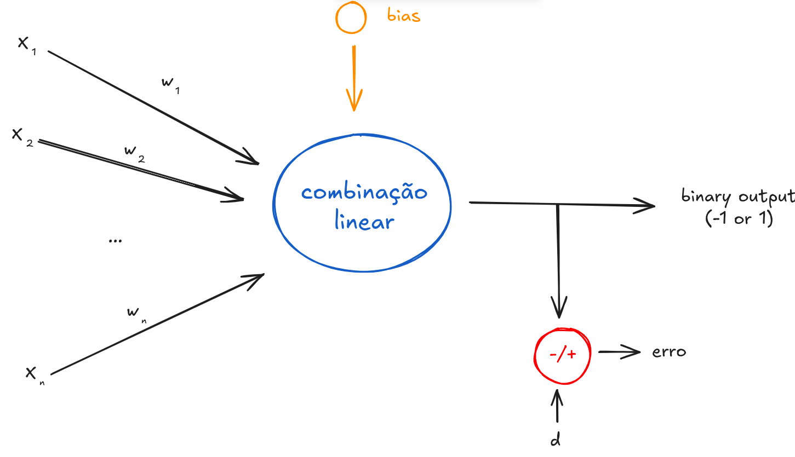
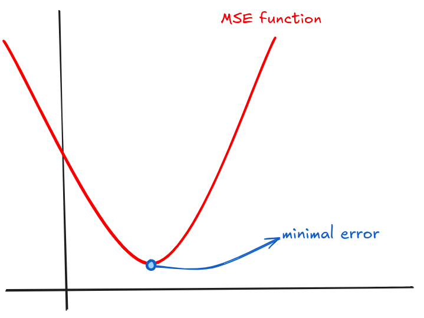

# adaline (adaptive linear neuron)



## about

this repository contains the implementation of an **adaline** neural network, using the **delta rule** for weight adjustment and minimization of the mean squared error (MSE). the script allows execution in both **stochastic** and **batch** modes.

## concepts

### decision boundary

the decision boundary is a line define by: 

$$w_1 \cdot x_1 + w_2 \cdot x_2 + \dots + w_n \cdot x_n - \theta = 0$$

### delta rule

the adaline uses the mean squared error to determine when weight recalculation should stop.

the MSE is a quadratic function (a parabola), so it has a minimum point, and adaline aims to reach it.



to reach this minimum point, we use gradient descent as a guide. the gradient is calculated from the derivative of the MSE function, and then the vector is inverted to indicate the direction of the parabola's minimum point.

so, the weight variation is defined as

$$
\Delta w = - lr \cdot \nabla E(w) 
$$

where E(w) is the error function of the weights w.

expanding the function E(w), we obtain:

$$
w_{current} = w_{previous} + lr \sum_{k=1}^{p}(d^{(k)} - u) \cdot x^{(k)}
$$

where u is the activation function of adaline.

## how to run

the `adaline.py` script processes data files and generates training and testing results.

```bash
python3 -m venv .venv

source .venv/bin/activate

pip install -r requirements.txt

python3 adaline.py
```