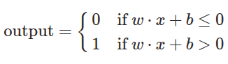

# biased-perceptron

the bias is a measure that says how easy it is to get the perceptron to output a 1

  

perceptrons can be used to compute elementary logical functions as *AND*, *OR* and *NAND*. 

a example of a percpetron with two inputs (w = -2) and bias = 3, we have:

  

this is a NAND logic gate