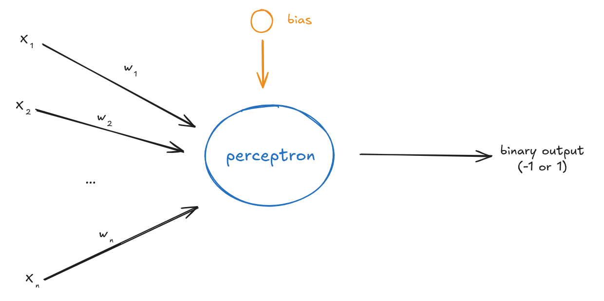

# Hebb Classification Perceptron

This perceptron project is from a master's degree class. It was built to process a training set to discover the weights of *n* parameters and then evaluate its performance on a test set.

The weight balancing is performed using the Hebb rule.

## Functions

### Training

The input is the training data, the labels, the learning rate, and the number of epochs.

By the end, it will have the updated weights, the number of completed epochs, and the error during the epochs.

### Testing

Use the learned weights to classify new data (test set).

Calculate the accuracy.

## Datasets

### Set #1

2 attributes, 140 training samples and 60 testing samples.

epochs = 100 | learning rate = 0.1

Calculate and show the accuracy in the training and test sets.

Plots:

- The training error evolution graph as a function of epochs

- The training data with the decision boundary

- The test data with the decision boundary

Discuss the results and explain what is happening.

*Obs.:* the decision boundary is a line define by $w_1 \cdot x_1 + w_2 \cdot x_2 + \dots + w_n \cdot x_n - \theta = 0$

### Set #2

2 attributes, 175 training samples and 75 testing samples.

Repeat the process from Set #1.

### Set #3

10 attributes, 147 training samples and 63 testing samples.

epochs = 100 | learning rate = 0.1

Calculate the training and testing accuracy.

Plot the training error evolution.

Conduct new tests, varying:

- Check learning rate $\eta \in \{0.1, 0.001, 0.0001\}$

- Number of epochs $\in \{100, 200\}$

For each parameter combination, perform training and testing, plotting the accuracy for each combination.

For each combination, plot the classification error vs. epochs.

Discuss the results and explain what's happening in each case.

*Optional:* Train and test several times, calculate the average and standard deviation of the accuracies.