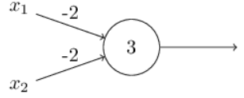

# hebb-perceptron

this perceptron implements the hebb rule for adjusting the weigths of the features

beyond that, a new parameter is added to the $g(u)$ function, the bias:

it is a measure that says how easy it is to get the perceptron to output a 1

  

perceptrons can be used to compute elementary logical functions as *AND*, *OR* and *NAND*. 

a example of a percpetron with two inputs (w = -2) and bias = 3, we have:

  

(this diagram shows a NAND logic gate)