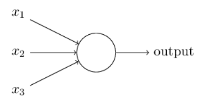
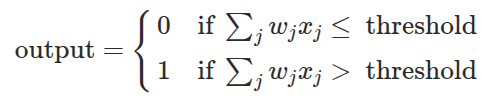

# muscle-perceptron

>*are you a fake natty?*

## about

here i coded a simple perceptron with 3 params, and its respective weights

```c++
string param_names[3] = {"working out", "eating healthy", "playing sports"};
int weights[3] = {6, 4, 3};
int threshold = sum_array(weights) / 2;
```

the input is binary values, if you answer "yes" -> $input = 1$, else $input = 0$

the diagram of the perceptron is like:

<p align="center">
  
</p>

## concepts

the `threshold` is the limiar of the perceptron, that means that what decides if the output of the perceptron will be 0 (won't build muscles) or 1 (will build muscles)

<p align="center">
  
</p>

## how to run

```bash
cmake -S . -B build
cmake --build build
./build/muscle-perceptron
```
